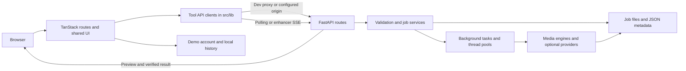
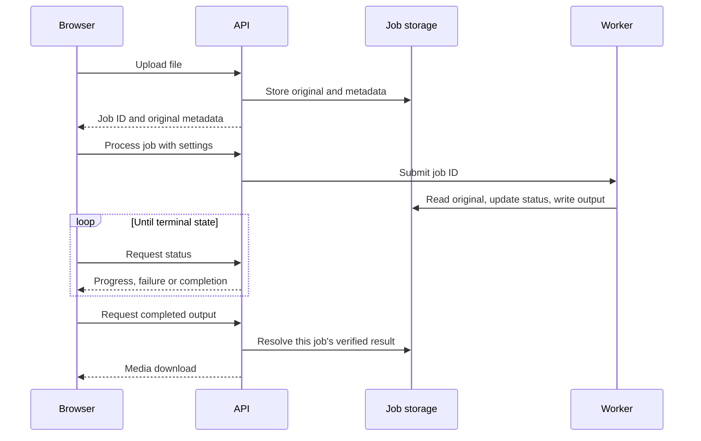

# Bellix.us — Architecture and project flow

Baseline: 2026-09-25. Current means present in this checkout, not verified in deployed infrastructure.

## Current stack

| Layer | Implementation |
| --- | --- |
| Web | React 19, TypeScript, TanStack Start/Router, Vite |
| UI | Tailwind CSS 4, Radix/shadcn, Framer Motion, Lucide |
| Client state | React, Zustand demo user store, localStorage |
| API | Python FastAPI, Pydantic, Uvicorn |
| Media | FFmpeg/ffprobe, OpenCV, tool-specific engines/providers |
| Execution | In-process thread pools and FastAPI background tasks |
| Persistence | Job-specific local directories and JSON metadata |
| Deployment configuration | Vercel frontend; Python Dockerfile and Railway |

Next.js packages/configuration remain, but npm dev/build invoke Vite. Supabase is scaffolded. Redis/Celery, database-backed billing and managed job storage are proposed architecture, not established current services.

## System flow

`/remove/image` currently follows a separate simulated browser flow through `pipeline.ts`.

## Source map

| Path | Responsibility |
| --- | --- |
| `src/routes/` | File-based pages, metadata and tool screens |
| `src/routes/__root.tsx` | Shared application shell |
| `src/router.tsx`, `src/start.ts`, `src/server.ts` | Router, startup and SSR integration |
| `src/routeTree.gen.ts` | Generated route tree; do not hand-edit |
| `src/components/site/` | Navigation, footer, upload/comparison and video cleaner |
| `src/components/ui/` | Shared primitives |
| `src/lib/*Api.ts`, `src/lib/videoJobs.ts` | API contracts and job communication |
| `src/lib/userStore.ts`, `src/lib/history.ts` | Browser-controlled state, not authorization |
| `backend/api/` | Upload/process/status/result/deletion endpoints |
| `backend/models/`, `backend/schemas/` | Job records and request contracts |
| `backend/services/`, `backend/engines/` | Storage, processing and verification |
| `backend/workers/` | Background orchestration |
| `backend/storage/` | Runtime files, not source fixtures |
| `backend/tests/` | Python regression tests |
| `public/`, `src/assets/` | Brand assets, samples and static media |

## API map

| Tool/client | Main sequence |
| --- | --- |
| Video cleanup / `videoJobs.ts` | `POST /api/video/upload` → `POST /api/video/process` → `GET /api/video/status/{job_id}` → result/download |
| Upscale / `imageApi.ts` | `POST /api/image/upscale` → `GET /api/image/status/{job_id}` → result/download |
| PDF / `pdfApi.ts` | `POST /api/pdf/upload` → `/detect/{job_id}` → `/process/{job_id}` → status/download |
| Background / `backgroundApi.ts` | `/api/v1/background/process` or `/remove` → `/api/v1/jobs/{job_id}` → result/download; composite/refine actions |
| Enhancer / `videoEnhancerApi.ts` | `POST /api/v1/video/upload` → `/inspect` → `/process` → `/jobs/{job_id}` or `/events` → `/result` |

Video cleanup also exposes `/api/video-watermark`; background has `/api/background` aliases. Preserve compatibility. Running FastAPI `/docs` and `/openapi.json` provide complete request/response contracts.

## Job lifecycle

Video upload validates input, allocates a UUID directory, stores the original and records metadata. Processing detects/tracks the selected region, processes frames, reconstructs video/audio and exposes output after completion. Stage names differ by tool; clients must follow their own declared status types.

Video `JobService` saves JSON via temporary-file replacement and an in-process lock. This does not provide distributed locking or durable queue recovery. UUID/path isolation is not authenticated ownership. Multiple replicas and process restarts need explicit recovery/shared-state design.

## Configuration and deployment

- `VITE_API_URL` is the preferred shared client API origin. Legacy fallbacks include `VITE_VIDEO_API_URL`, and `VITE_IMAGE_API_URL` for image/PDF clients.
- Empty origins produce relative URLs. Vite proxies `/api/video`, `/api/video-watermark`, `/api/image`, `/api/pdf`, `/api/background`, `/api/v1` to port 8000 during development.
- Development proxies are not production rewrites. Set the public backend origin at frontend build time or provision a production reverse proxy.
- `VITE_SUPABASE_URL` and `VITE_SUPABASE_ANON_KEY` configure the optional public client. Never expose privileged keys with `VITE_`.
- Backend configuration loads `backend/.env` and environment variables; `OPENROUTER_API_KEY` is server-only. Defaults are in `backend/config.py`.
- Docker uses Python 3.11, installs FFmpeg, starts Uvicorn with `PORT` and checks `/health`. Railway references the Dockerfile; Vercel runs `npm run build`.
- Verify mounted storage, model readiness, filesystem permissions and API connectivity in each environment. `/health` alone is not a model test.

## Proposed production evolution

First enforce job ownership and truthful capabilities. Then add database-backed identity/job/credit records, object storage and a durable worker queue with retry/cancellation. Add idempotent billing and scheduled deletion. Provider selection and migration are future tasks, not installed components.
