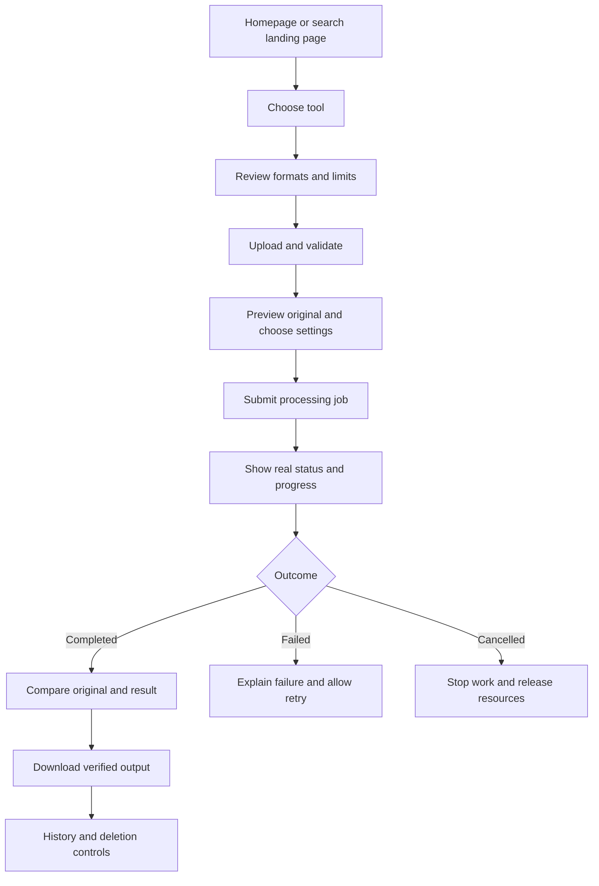

# Bellix.us — Product definition and website analysis

Baseline: 2026-09-25. This document separates observed behavior, repository evidence and proposed requirements. It does not certify production readiness.

## Product and scope

Bellix.us is a browser-based media toolkit for creators, editors, agencies and product teams. The core journey is: choose a tool, upload media you own or are authorized to edit, select settings, process, compare and download.

The public homepage, `/tools`, `/pricing` and `/remove/video` returned HTTP 200 during read-only HTML inspection. No uploads, payment, authenticated sessions, mobile rendering or production model execution were tested.

## Current feature inventory

| Route | Purpose | Implementation evidence and limitation |
| --- | --- | --- |
| `/` | Creative suite landing page | Live HTML and `src/routes/index.tsx`; marketing claims require validation |
| `/tools` | Tool discovery | Five main tools; title and copy still use Pilio branding |
| `/remove/video` | Video watermark cleanup | `JobVideoCleaner.tsx`, `videoJobs.ts`, FastAPI routes/workers |
| `/gemini-video-watermark-remover` | Specialized video entry | Existing route with video cleaning experience |
| `/remove/image` | Brush-based image cleanup | Simulated `runPipeline`; not verified restoration |
| `/upscale` | Image upscaling | `imageApi.ts` and `/api/image/upscale` |
| `/video-enhancer` | Video enhancement | Dedicated API, worker, status/events and result endpoints |
| `/background-remover` | Cutout/refinement/compositing | Dedicated background API/services |
| `/pdf-watermark-remover` | Document cleanup | Upload, detect, process, preview/download API |
| `/history` | Processing history | Browser state; not verified account-wide persistence |
| `/pricing` | Plan comparison | CTAs navigate to tools/API pages; payment enforcement not established |

Other source routes: `/about`, `/contact`, `/features`, `/faq`, `/how-it-works`, `/api-reference`, `/affiliate`. A route existing does not prove its forms or advertised service work end to end.

## Website findings

1. Current identity is a light white/rose creative studio. Old dark-theme and Next.js prompts in README are historical material.
2. The homepage advertises a broader suite than the tool directory. Named models, GPU hardware, quality percentages, processing times and export claims need capability evidence.
3. `/tools` uses Pilio branding. Standardize product name and metadata on Bellix.us.
4. The homepage promises transient-memory/zero-retention processing, but backend media and metadata persist on disk. A 24-hour retention setting exists; no scheduled expiration consumer was found in the source search.
5. Homepage footer Privacy Policy, Terms of Service and Security labels render as spans, not navigable links.
6. Image-cleaner completion is simulated. An animation must not imply verified pixel restoration.
7. Accounts, roles and credits include browser-controlled demo state. Supabase configuration/schema comments are scaffolding, not enforced authentication or billing.
8. Pricing claims and backend defaults disagree. Resolve them before selling enforced entitlements.

Sources: [homepage](https://www.bellix.us/), [tools](https://www.bellix.us/tools), [pricing](https://www.bellix.us/pricing), [video cleaner](https://www.bellix.us/remove/video), plus repository paths above. Live findings are a dated snapshot.

## Advertised pricing — not enforced entitlements

| Plan | Monthly billing | Annual monthly equivalent | Advertised credits/month |
| --- | --- | --- | --- |
| Starter Free | $0 | $0 | 5 |
| Creator Pro | $19 | $15 ($180/year) | 150 |
| Studio & API | $49 | $39 ($468/year) | 600 |

The page defaults to annual billing (`src/routes/pricing.tsx`). Backend defaults include 500 MB video uploads, a 60-second video analysis limit, 35 MB image/background uploads and 50 MB/100-page PDFs (`backend/config.py`). Route-specific validation remains authoritative; unlimited pricing copy is not a backend guarantee.

## Target user flow

Individual tools currently implement different subsets. Simulated image cleanup is an explicit exception.

## Acceptance criteria and metrics

- Completed outputs derive from the submitted file and match its job identity.
- UI and server agree on format, byte, duration, page and pixel limits.
- Failure/cancellation never produces a fake successful download or duplicate credit charge.
- Comparison works on touch/keyboard and illustrative samples are labeled honestly.
- Privacy copy matches storage, deletion and external-provider behavior.
- Paid access requires server-side identity, entitlements and verified payment events.
- Measure completion/failure rates by tool, median/p95 processing time, time to first download and cost per completed job. Targets require a measured baseline; none was measured here.

See [TASKS.MD](TASKS.MD) for priorities and [ARCHITECTURE.MD](ARCHITECTURE.MD) for system flow.
